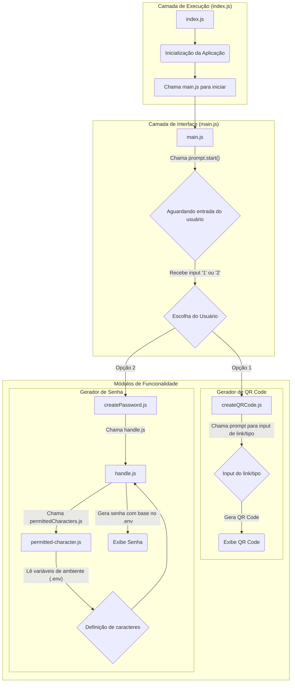

# Gerador de Senhas e QRCodes para e-commerce
Esta é uma aplicação de linha de comando desenvolvida em Node.js para um e-commerce, que oferece duas funcionalidades principais, podendo ser escalável, que são:
1. __Gerador de Senhas Seguras__: Cria senhas aleatórias com base em critérios personalizáveis (tamanho e tipo de caracteres) definidos através de variáveis de ambiente.
2. __Gerador de QR Codes__: Converte um link fornecido pelo usuário em um QR Code, que pode ser exibido diretamente no terminal ou em um arquivo de imagem.

O objetivo do projeto é demonstrar o uso de módulos, gerenciamento de dependências (npm), manipulação de variáveis de ambiente e interação com o usuário via terminal.

### 💻  Requisitos do Sistema
* __Node.js__ (versão 14 ou superior)
* __npm__ (gerenciador de pacotes do Node.js, geralmente vem com a instalação do Node)

### 🛠️  Instalação e Execução
#### Passo 1: Clone o Repositório
```Bash
git clone https://github.com/GilianoGN/QRCodes-Password.git
cd SeuRepositorio
```
#### Passo 2: Instale as Dependências
```Bash
npm install
```
#### Passo 3: Configure as Variáveis de Ambiente (Opcional para senhas)
Para personalizar o gerador de senhas, crie um arquivo .env na raiz do projeto. Caso não exista, o gerador usará valores padrão.

Exemplo de arquivo .env:

```
Snippet de código
```
```
UPPERCASE_LETTERS=true
LOWERCASE_LETTERS=true
NUMBERS=true
SPECIAL_CHARACTERS=true
PASSWORD_LENGTH=12
```

#### Passo 4: Execute a Aplicação
```Bash
node --env-file=.env src/index.js
```
Ao executar o comando, o terminal irá apresentar um menu interativo para que você escolha entre gerar uma senha ou um QR Code.

### ⚙️  Estrutura do Projeto
A arquitetura da aplicação é modular, com cada funcionalidade encapsulada em seu próprio conjunto de arquivos. Isso facilita a manutenção e a adição de novas funcionalidades no futuro.


### 🔬  Tecnologias Utilizadas
* __Node.js__: Ambiente de execução JavaScript.

* __Prompt__: Biblioteca para interagir com o usuário via linha de comando.

* __Chalk__: Biblioteca para estilizar a saída do terminal com cores.

* __qrcode-terminal__: Biblioteca para geração de QRCodes.

### 📚  Contribuições
Contribuições são sempre bem-vindas! Se você encontrar um bug ou tiver uma ideia de melhoria, sinta-se à vontade para abrir uma issue ou enviar um pull request.

### 📓  Licença
Este projeto está sob a licença ISC.

### 🎯  Objetivos e Resultados Esperados
Após a conclusão do projeto, os estudantes estarão aptos a:
* Criar projetos NodeJS que gerem multiplas dependências
